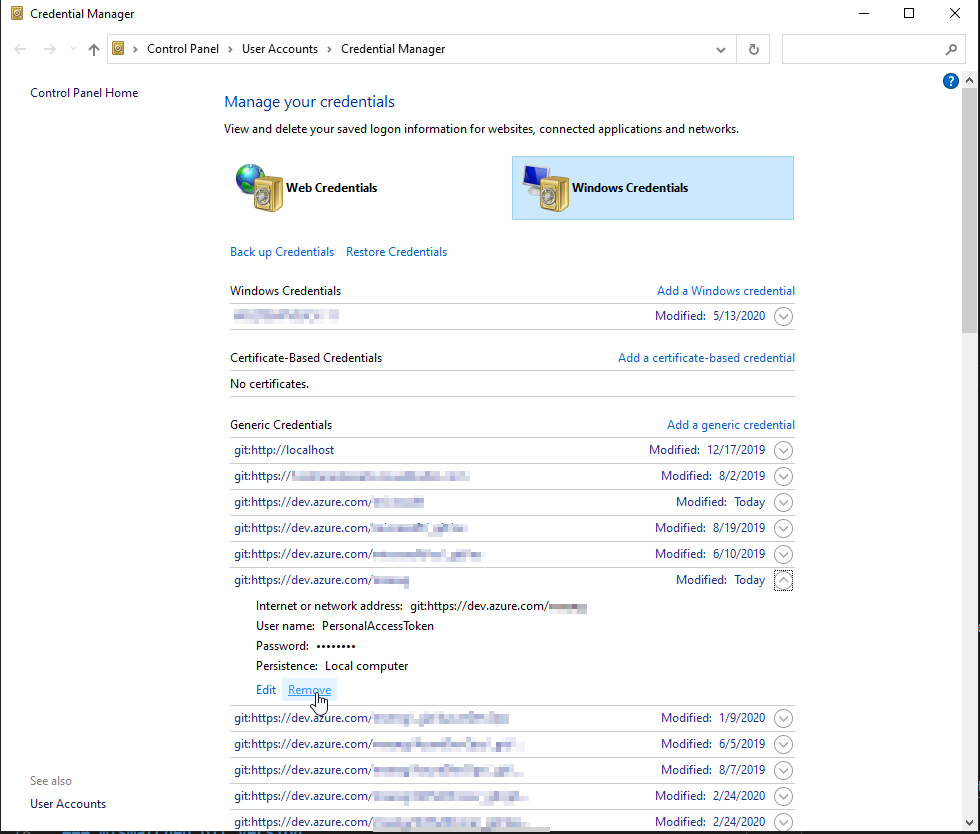
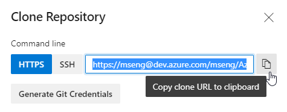

Troubleshooting
===============

Deleting a VFS for Git repo
---------------------------

Since a VFS for Git clone has a running `GVFS.Mount` process to track the
Git index and watch updates from the ProjFS filesystem driver, you must
first run `gvfs unmount` before deleting your repository. This will also
remove the repository from the auto-mount feature of `GVFS.Service`.

If you have deleted the enlistment or its `.gvfs` folder, then you will
likely see alerts saying "Failed to auto-mount at path `X`". To remove
this enlistment from the auto-mount feature, remove the appropriate line
from the `C:\ProgramData\GVFS\GVFS.Service\repo-registry` file.

Common Issues
-------------

We are constantly improving VFS for Git to prevent known issues from
reoccurring. Please make sure you are on the latest version using `gvfs upgrade`
before raising an issue. Please also keep your version of Windows updated
as that is the only way to get updates to the ProjFS filesystem driver.

### TRY THESE STEPS FIRST

1. **Upgrade.** Please double-check that you are on a recent release of VFS for Git.
   Go to [the releases page](https://github.com/microsoft/vfsforgit/releases)
   and select the top release or pre-release.

2. **Run `gvfs repair`.** Some known issues can get your enlistment into a
   bad state. Running `gvfs repair` will detect known issues and the output
   will mention if the issue is actionable or not. Then, `gvfs repair --confirm`
   will actually make the changes it thinks are necessary. If `gvfs repair`
   detects a problem but says it cannot fix the problem, then that's an
   excellent message to include when creating an issue.

3. **Run `gvfs unmount`, `gvfs mount`, or restart.** Sometimes the
   `GVFS.Mount` process gets in a bad state and simply needs to
  restart to auto-heal. Since VFS for Git also interacts directly with the
  ProjFS filesystem driver, sometimes a system restart can help.

### Authentication issues

**Symptom:** `gvfs clone <url>` fails with 404 errors or
`The Git repository with name or identifier X does not exist...`

**Fix:** Try the following:

1. Check if you can access `<url>` in a web browser. If you cannot see the
  repository in the web, then you do not have permissions to read that repository.
  These issues cannot be resolved by the VFS for Git team and must be done
  by your repository administrators.

2. If you _can_ see the repository in the web, then likely you have a stale
  credential in your credential manager that needs updating. VFS for Git
  _should_ attempt to renew your credential. If it does not, then go to
  Windows Credential Manager and delete the Git credential for that URL.



**Symptom:** Clone or mount fails with `fatal: could not read Username for 'https://<org>.visualstudio.com': terminal prompts disabled`

**Fix:** The URL pattern `https://<org>.visualstudio.com` is an old way of interacting with Azure Repos. The new URL pattern is `https://<org>@dev.azure.com/<org>/`. Please recreate your enlistment using the URL from Azure Repos by clicking the "Clone" button and copying the HTTPS URL as follows:




### Upgrade issues

The `GVFS.Service` process checks for new versions of VFS for Git daily and
will prompt you for upgrade using a notification. To check manually, run
`gvfs upgrade` to see if an upgrade is available. Run `gvfs upgrade --confirm`
to actually perform the upgrade, if you wish.

**Symptom:** `gvfs upgrade` fails with the following error:

> ERROR: Could not launch upgrade tool. File copy error - The specified path, file name, or both are too long"

**Fix:** There is a known issue with VFS for Git v1.0.20112.1 where the
`gvfs upgrade` command fails with a long-path error. The root cause is a
[recursive directory copy](https://github.com/microsoft/VFSForGit/pull/1672)
that loops the contents of that directory into the copy and it never ends.
The only fix is to [manually upgrade to version v1.0.20154.3](https://github.com/microsoft/VFSForGit/releases/tag/v1.0.20154.3).
### Mismatched Git version

**Symptom:** Enlistment fails to mount with an error such as

```
Warning: Installed git version <X> does not match supported version of <Y>
```

**Fix:** VFS for Git is tightly coupled to
[a custom version of Git](https://github.com/microsoft/git). This error
happens when the installed version of Git does not match the one that was
included in the VFS for Git installer. Please download and install the
matching version of Git from
[the VFS for Git releases page](https://github.com/microsoft/vfsforgit/releases).

### ProjFS Installation Issue

**Symptoms:**

- VFS for Git will not mount
- The mount logs (or mount CLI) have a ProjFS related error.
Examples:
   - "Service prjflt was not found on computer".
    - "Could not load file or assembly 'ProjectedFSLib.Managed.dll' or one
      of its dependencies. The specified module could not be found."
    - "Attaching the filter resulted in: 2149515283"
    - "StartVirtualizationInstance failed: 80070057(InvalidArg)"

**Fix:**

The easiest way to fix ProjFS issues is to completely remove ProjFS, and 
then rely on `GVFS.Service` to re-install (or re-enable) ProjFS.

1. If `C:\Program Files\GVFS\ProjectedFSLib.dll` is present, delete it
2. Determine if inbox ProjFS is currently enabled:

*In an Administrator Command Prompt*

```powershell -NonInteractive -NoProfile -Command "&{Get-WindowsOptionalFeature -Online -FeatureName Client-ProjFS}"```

Check the value of `State:` in the output to see if inbox ProjFS is enabled.

3. If ProjFS **is enabled**
   - Restart machine
   - Attempt to mount
   - If mount fails, manually disable ProjFS:
       - Control Panel->Programs->Turn Windows features on or off
       - Uncheck "Windows Projected File System"
      - Click OK
      - Restart machine
      - (When `GVFS.Service` starts, it will automatically re-enable the optional feature)
    - `gvfs mount` repo
    - If the mount still fails, restart one more time and try `gvfs mount` again

4. If ProjFS **is not enabled**
    - Manually remove ProjFS and GvFlt
    From an Administrator command prompt:
        - `sc stop GVFS.Service`
       -  `sc stop gvflt`
       -  `sc delete gvflt`
       - `sc stop prjflt`
      - `sc delete prjflt`
      - `del c:\Windows\System32\drivers\prjflt.sys`
      - `sc start GVFS.Service`
    - `gvfs mount` repo

If the above steps do not resolve the issue, and the user is on Windows
Server, ensure they have
[the latest version of GVFS installed](https://github.com/microsoft/vfsforgit/releases).

### Unable to Move/Rename directories inside GVFS repository.

**Symptom:**
User is not able to rename or move a partial directory inside their
VFS for Git enlistment. If rename or move is done using Windows Explorer,
the user might see an error alert with message ```Error 0x80070032: The request is not supported.```

**Fix:**
Partial directories are directories that originate from the virtual projection.
They exist on disk and still contain ProjFS reparse data. When an application
enumerates a partial directory ProjFS calls VFS for Git's enumeration callbacks.

VFS for Git does not support rename or move of partial directories inside an
enlistment. However it supports rename/move of a regular directory. User can
copy the partial directory and paste it inside the enlistment. The newly pasted
directory is a regular directory and can be renamed or moved around inside the
enlistment. The original partial directory can now be deleted.

Diagnosing Issues
-----------------

The `gvfs diagnose` command collects logs and config details for the current
repository. The resulting zip file helps root-cause issues.

When run inside your repository, creates a zip file containing several important
files for that repository. This includes:

* All log files from `gvfs` commands run in the enlistment, including
  maintenance steps.

* Log files from the `GVFS.Service`.

* Configuration files from your `.git` folder, such as the `config` file,
  `index`, `hooks`, and `refs`.

* A summary of your Git object database, including the number of loose objects
  and the names and sizes of pack-files.

As the `diagnose` command completes, it provides the path of the resulting
zip file. This zip can be sent to the support team for investigation.

Modifying Configuration Values
------------------------------

### Cache Server URL

Cache servers are a feature of the GVFS protocol to provide low-latency
access to the on-demand object requests. This modifies the `gvfs.cache-server`
setting in your local Git config file.

Run `gvfs cache-server --get` to see the current cache server.

Run `gvfs cache-server --list` to see the available cache server URLs.

Run `gvfs cache-server --set=<url>` to set your cache server to `<url>`.

### System-wide Config

The `gvfs config` command allows customizing some behavior.

1. Set system-wide config settings using `gvfs config <key> <value>`.
2. View existing settings with `gvfs config --list`.
3. Remove an existing setting with `gvfs config --delete <key>`.

The `usn.updateDirectories` config option, when `true`, will update the
[USN journal entries](https://docs.microsoft.com/en-us/windows-server/administration/windows-commands/fsutil-usn)
of directories when the names of subdirectories or files are modified,
even if the directory is still only in a "projected" state. This can be
particularly important when using incremental build systems such as
microsoft/BuildXL. However, there is a 10-15% performance penalty on some
Git commands when this option is enabled.

The `gvfs config` command is also used for customizing the feed used for
VFS for Git upgrades. This is so large teams can bundle a custom installer
or other tools along with VFS for Git upgrades.
